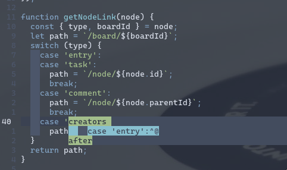

# yanks.nvim
Yank history

A simple yank history plugin



Full line / word yanks are highlighted differently

## Installation

```
Plug 'NickyTope/yanks.nvim'
```
...or just copy the yanks.vim file into `~/.config/nvim/plugin`

## Usage

Make a map in your `init.vim`

e.g.

```
nmap <c-y> <Plug>(Yanks)
```

Shortcuts:

The following are mapped when the menu is open:

| Key   | Action                                  |
| ---   | ---                                     |
| Esc   | Close the menu                          |
| Enter | put the selected yank                   |
| dd    | remove the selected yank from the list  |
| P     | Put the select yank (before the cursor) |

## Config

> Need to make more of what this does configurable...

`let g:yanks_max = 10` -- Max number of yanks to remember (default 25)
